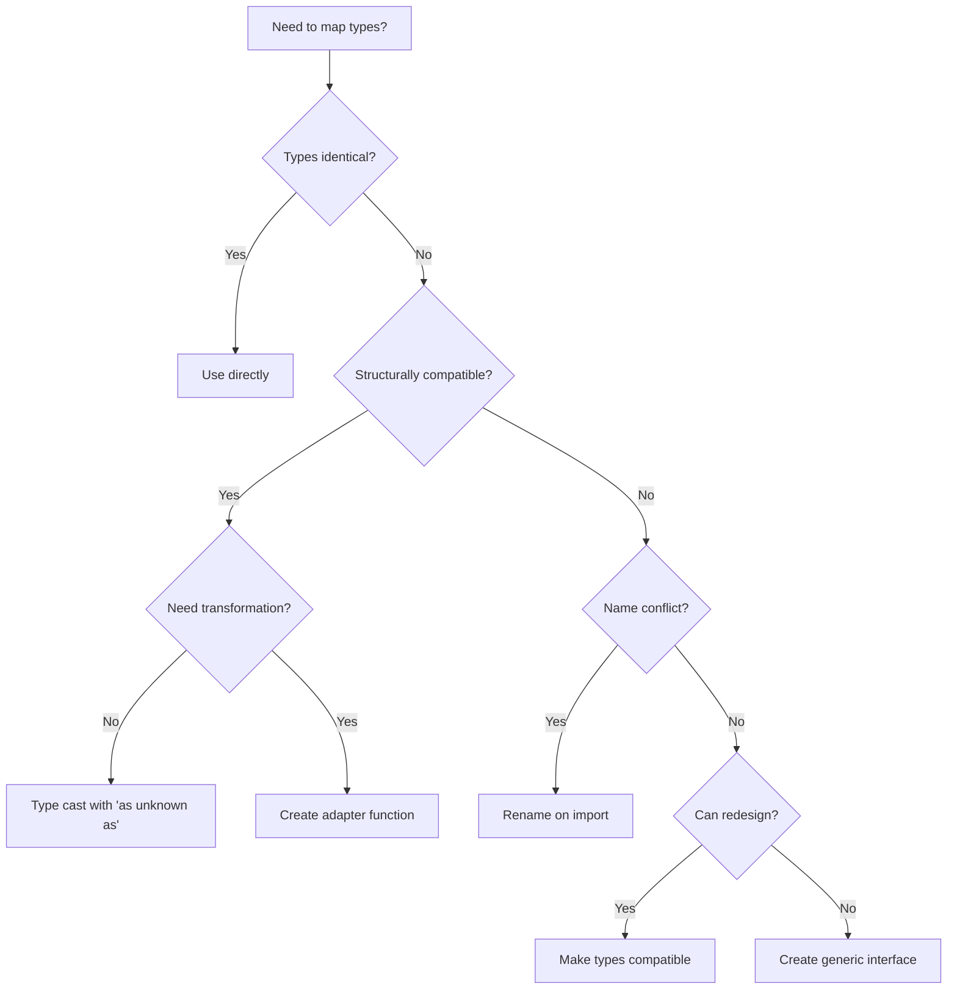

# Type Mapping Patterns

**Comprehensive guide to type mapping strategies in the DotMac FTTH codebase**

> **Version:** 1.0.0
> **Last Updated:** 2025-11-09
> **TypeScript Version:** 5.x
> **tsconfig:** `exactOptionalPropertyTypes: true`

---

## Table of Contents

1. [Overview](#overview)
2. [Pattern Catalog](#pattern-catalog)
3. [exactOptionalPropertyTypes Guide](#exactoptionalpropertytypes-guide)
4. [Dependency Injection Patterns](#dependency-injection-patterns)
5. [Callback Type Mapping](#callback-type-mapping)
6. [Common Transformations](#common-transformations)
7. [Type Testing](#type-testing)
8. [Anti-Patterns](#anti-patterns)
9. [Real-World Examples](#real-world-examples)
10. [Migration Checklist](#migration-checklist)
11. [Troubleshooting](#troubleshooting)
12. [Quick Reference](#quick-reference)

---

## Overview

### Why Type Mapping Is Needed

In our monorepo architecture, we have:

- **Shared packages** (`@dotmac/features`, `@dotmac/ui`, `@dotmac/headless`) with reusable components
- **App-specific types** in `apps/isp-ops-app` and `apps/platform-admin-app`
- **TypeScript strict mode** with `exactOptionalPropertyTypes: true`

This creates scenarios where types need to be mapped between layers:

```
┌─────────────────────────────────────────┐
│  Shared Components (@dotmac/features)   │
│  - Generic interfaces                   │
│  - Type: SharedInvoice                  │
└──────────────┬──────────────────────────┘
               │
               │ Type Mapping Needed
               │
┌──────────────▼──────────────────────────┐
│  App-Specific Implementation            │
│  - Concrete types                       │
│  - Type: AppInvoice                     │
└─────────────────────────────────────────┘
```

### Design Philosophy

1. **Shared components are type-generic** - They accept dependencies via props
2. **Apps provide concrete implementations** - They inject app-specific types
3. **Type mapping happens at boundaries** - Wrappers convert between type systems
4. **Safety is paramount** - No silent type errors, explicit conversions only

---

## Pattern Catalog

### Pattern 1: Identical Types (No Mapping)

**When to use:** Types are structurally identical between shared and app layers.

**Example:**

```typescript
// Shared type
export interface Customer {
  id: string;
  name: string;
  email: string;
}

// App type (identical)
export interface Customer {
  id: string;
  name: string;
  email: string;
}

// ✅ Direct usage - no mapping needed
import { CustomerList } from "@dotmac/features/customers";
<CustomerList customers={customers} />
```

**When it works:**

- Simple data structures
- No optional property differences
- No enum vs string differences
- Both use same null/undefined handling

---

### Pattern 2: Type Casting (Structural Compatibility)

**When to use:** Types differ in name but are structurally compatible.

**Example:**

```typescript
// File: apps/isp-ops-app/components/billing/InvoiceList.tsx

import { InvoiceList } from "@dotmac/features/billing";
import type { Invoice as SharedInvoice } from "@dotmac/features/billing";
import type { Invoice } from "@/types";

interface InvoiceListWrapperProps {
  tenantId: string;
  onInvoiceSelect?: (invoice: Invoice) => void;
}

export default function InvoiceListWrapper({
  tenantId,
  onInvoiceSelect,
}: InvoiceListWrapperProps) {
  // Map shared Invoice callback to app-specific Invoice type
  const handleInvoiceSelect = onInvoiceSelect
    ? (invoice: SharedInvoice) => {
        // Type cast when structurally compatible
        onInvoiceSelect(invoice as unknown as Invoice);
      }
    : undefined;

  return (
    <InvoiceList
      tenantId={tenantId}
      onInvoiceSelect={handleInvoiceSelect}
      apiClient={apiClient}
      logger={logger}
      router={router}
      useConfirmDialog={useConfirmDialog}
    />
  );
}
```

**Why `as unknown as`:**

- TypeScript won't allow direct casting between unrelated types
- `as unknown as` is the safe escape hatch
- Documents that we're intentionally converting types

**When to use:**

- Types have same shape but different names
- Properties are compatible
- No runtime transformation needed
- Callbacks where types differ only nominally

**When to avoid:**

- Types have different optional properties
- Types have different null/undefined handling
- Properties have incompatible types
- Runtime transformation is needed

---

### Pattern 3: Adapter Functions (Complex Mapping)

**When to use:** Types need runtime transformation.

**Example:**

```typescript
// File: shared/packages/features/src/crm/components/CustomerActivities.tsx

export interface CustomerActivity {
  id: string;
  customer_id: string;
  activity_type: string;
  title: string;
  description: string | undefined;        // ✅ Explicit undefined
  metadata: Record<string, any> | undefined; // ✅ Explicit undefined
  created_at: string;
}

export interface CustomerActivitiesHook {
  activities: CustomerActivity[];
  loading: boolean;
  error: string | undefined;  // ✅ Not `| null`
  addActivity: (activity: Omit<CustomerActivity, "id" | "customer_id" | "created_at">) => Promise<void>;
}

// App hook returns different type
interface AppActivitiesHook {
  activities: AppActivity[];
  loading: boolean;
  error: string | null;  // ❌ Returns null
  addActivity: (activity: AppActivityInput) => Promise<void>;
}

// ✅ Adapter function
function adaptActivitiesHook(hook: AppActivitiesHook): CustomerActivitiesHook {
  return {
    activities: hook.activities.map(adaptActivity),
    loading: hook.loading,
    error: hook.error ?? undefined,  // Convert null to undefined
    addActivity: async (activity) => {
      await hook.addActivity(adaptActivityInput(activity));
    },
  };
}

// Usage in app
export function CustomerActivitiesWrapper({ customerId }: Props) {
  const appHook = useAppActivities(customerId);
  const adaptedHook = adaptActivitiesHook(appHook);

  return (
    <CustomerActivities
      customerId={customerId}
      useCustomerActivities={() => adaptedHook}
      logger={logger}
    />
  );
}
```

**Pattern benefits:**

- Type-safe transformations
- Testable in isolation
- Reusable across components
- Clear conversion logic

---

### Pattern 4: Generic Interfaces (Flexible Types)

**When to use:** Shared components should work with multiple app type variations.

**Example:**

```typescript
// File: shared/packages/features/src/billing/components/InvoiceList.tsx

// ✅ Generic API client interface
export interface BillingApiClient {
  get: <T = any>(url: string, config?: any) => Promise<{ data: T }>;
  post: <T = any>(url: string, data?: any, config?: any) => Promise<{ data: T }>;
}

// ✅ Generic logger interface
export interface Logger {
  error: (message: string, error: Error, context?: any) => void;
}

// ✅ Generic router interface
export interface Router {
  push: (url: string) => void;
}

export interface InvoiceListProps {
  tenantId: string;
  onInvoiceSelect: ((invoice: Invoice) => void) | undefined;
  apiClient: BillingApiClient; // App provides implementation
  logger: Logger; // App provides implementation
  router: Router; // App provides implementation
  useConfirmDialog: () => BillingConfirmDialogFn;
}
```

**App implementation:**

```typescript
// File: apps/isp-ops-app/lib/api/client.ts

// ✅ Implements BillingApiClient interface
export const apiClient = {
  get: async <T = any>(url: string, config?: any) => {
    const response = await axios.get(url, config);
    return { data: response.data as T };
  },
  post: async <T = any>(url: string, data?: any, config?: any) => {
    const response = await axios.post(url, data, config);
    return { data: response.data as T };
  },
};

// File: apps/isp-ops-app/lib/logger.ts

// ✅ Implements Logger interface
export const logger = {
  error: (message: string, error: Error, context?: any) => {
    console.error(message, error, context);
    // Send to monitoring service
  },
};
```

**Why this works:**

- Shared component doesn't depend on specific implementations
- Apps can use any HTTP client (axios, fetch, ky, etc.)
- Easy to mock for testing
- Clear contract between layers

---

### Pattern 5: Interface Renaming (Conflict Avoidance)

**When to use:** Type names conflict between shared and app layers.

**Example:**

```typescript
// ❌ BAD: Name conflict
import { ApiClient } from "@dotmac/features/billing";
import { ApiClient } from "@/lib/api"; // ERROR: Duplicate identifier

// ✅ GOOD: Rename on import
import { ApiClient as BillingApiClient } from "@dotmac/features/billing";
import { ApiClient } from "@/lib/api";

// ✅ GOOD: Different names in source
export interface BillingApiClient {
  get: <T = any>(url: string, config?: any) => Promise<{ data: T }>;
  post: <T = any>(url: string, data?: any, config?: any) => Promise<{ data: T }>;
}

export interface RbacApiClient {
  get: <T = any>(url: string, config?: any) => Promise<{ data: T }>;
  post: <T = any>(url: string, data?: any, config?: any) => Promise<{ data: T }>;
  delete: <T = any>(url: string, config?: any) => Promise<{ data: T }>;
}
```

**Naming conventions:**

- Prefix interface names with module/feature: `BillingApiClient`, `RbacApiClient`
- Use descriptive names: `CustomerActivitiesHook` not just `Hook`
- Avoid generic names like `Props`, `Data`, `Config`

---

## exactOptionalPropertyTypes Guide

### The Problem

TypeScript's `exactOptionalPropertyTypes: true` enforces strict distinction between:

- `property?: Type` - Can be omitted, CANNOT be `undefined`
- `property: Type | undefined` - Can be omitted OR explicitly `undefined`

This causes issues when:

1. API returns `null` but we want `undefined`
2. Using object spread with conditional properties
3. Mixing optional syntax in interfaces

### The Solution: Always Use Explicit `| undefined`

```typescript
// ❌ WRONG (with exactOptionalPropertyTypes: true)
interface Bad {
  optional?: string; // Cannot assign undefined
  nullish: string | null; // Incompatible with | undefined
}

// ✅ CORRECT
interface Good {
  optional: string | undefined; // Can be omitted or undefined
  nullish: string | null | undefined; // Works with both
}
```

### Real Example from Codebase

```typescript
// File: shared/packages/features/src/crm/components/CreateLeadModal.tsx

export interface LeadCreateRequest {
  first_name: string;
  last_name: string;
  email: string;
  phone: string;
  company_name: string | undefined; // ✅ Explicit
  service_address_line1: string;
  service_address_line2: string | undefined; // ✅ Explicit
  service_city: string;
  service_state_province: string;
  service_postal_code: string;
  service_country: string;
  source: LeadSource;
  priority: number;
  interested_service_types: string[];
  desired_bandwidth: string | undefined; // ✅ Explicit
  estimated_monthly_budget: number | undefined; // ✅ Explicit
  desired_installation_date: string | undefined; // ✅ Explicit
  notes: string | undefined; // ✅ Explicit
}
```

### Null to Undefined Conversion

```typescript
// Pattern: Convert null to undefined
error: hook.error ?? undefined;

// Pattern: Use nullish coalescing
const value = apiResponse.data ?? undefined;

// Pattern: Ternary for complex logic
const result = response.data ? transformData(response.data) : undefined;
```

### Object Property Assignment

```typescript
// ❌ WRONG: Conditional spread
const props = {
  name: "John",
  ...(email ? { email } : {}), // Type error with exactOptionalPropertyTypes
};

// ✅ CORRECT: Explicit undefined
const props = {
  name: "John",
  email: email || undefined,
};

// ✅ CORRECT: Conditional assignment
const props: MyProps = {
  name: "John",
  email: undefined,
};
if (email) {
  props.email = email;
}
```

### Array Handling

```typescript
// ✅ Explicit undefined for optional arrays
interface FormData {
  tags: string[] | undefined; // Not tags?: string[]
  attachments: File[] | undefined;
}

const formData: FormData = {
  tags: undefined, // Must be explicit
  attachments: undefined,
};
```

### Bulk Action Properties

```typescript
// File: shared/packages/features/src/billing/components/InvoiceList.tsx

const bulkActions: BulkAction<Invoice>[] = [
  {
    label: "Send Invoices",
    icon: MailIcon,
    action: handleBulkSend,
    disabled: (selected) => selected.every((inv) => inv.status === "void"),
    variant: undefined, // ✅ All optional props explicit
    confirmMessage: undefined,
    confirmTitle: undefined,
    confirmConfirmText: undefined,
    confirmVariant: undefined,
  },
  {
    label: "Void Invoices",
    icon: VoidIcon,
    action: handleBulkVoid,
    disabled: (selected) => selected.every((inv) => inv.status === "void" || inv.status === "paid"),
    variant: undefined,
    confirmMessage: undefined,
    confirmTitle: undefined,
    confirmConfirmText: undefined,
    confirmVariant: undefined,
  },
];
```

### Type Assertion with Return Types

```typescript
// ✅ Use return type annotation instead of assertion
function getOptionalValue(): string | undefined {
  return Math.random() > 0.5 ? "value" : undefined;
}

// Instead of:
function getOptionalValue() {
  return (Math.random() > 0.5 ? "value" : undefined) as string | undefined;
}
```

---

## Dependency Injection Patterns

### Pattern: API Client Interface

```typescript
// Shared interface (minimal, generic)
export interface BillingApiClient {
  get: <T = any>(url: string, config?: any) => Promise<{ data: T }>;
  post: <T = any>(url: string, data?: any, config?: any) => Promise<{ data: T }>;
}

// Why this shape:
// 1. Generic <T> allows type-safe responses
// 2. Consistent return shape: { data: T }
// 3. Optional config for headers, params
// 4. No dependency on axios/fetch specifics

// App implementation (axios)
export const apiClient: BillingApiClient = {
  get: async <T = any>(url: string, config?: any) => {
    const response = await axios.get(url, config);
    return { data: response.data as T };
  },
  post: async <T = any>(url: string, data?: any, config?: any) => {
    const response = await axios.post(url, data, config);
    return { data: response.data as T };
  },
};

// Alternative implementation (fetch)
export const apiClient: BillingApiClient = {
  get: async <T = any>(url: string, config?: any) => {
    const response = await fetch(url, config);
    const data = await response.json();
    return { data: data as T };
  },
  post: async <T = any>(url: string, data?: any, config?: any) => {
    const response = await fetch(url, {
      method: "POST",
      body: JSON.stringify(data),
      ...config,
    });
    const responseData = await response.json();
    return { data: responseData as T };
  },
};
```

### Pattern: Logger Interface

```typescript
// Shared interface
export interface Logger {
  error: (message: string, error: Error, context?: any) => void;
}

// Why this shape:
// 1. Simple, focused on error logging
// 2. Accepts Error object for stack traces
// 3. Optional context for structured logging
// 4. Returns void (fire-and-forget)

// App implementation (console + monitoring)
export const logger: Logger = {
  error: (message: string, error: Error, context?: any) => {
    console.error(message, error, context);

    // Send to monitoring service
    if (process.env.NODE_ENV === "production") {
      sentryClient.captureException(error, {
        extra: { message, ...context },
      });
    }
  },
};

// Test implementation (mock)
export const mockLogger: Logger = {
  error: jest.fn(),
};
```

### Pattern: Router Interface

```typescript
// Shared interface
export interface Router {
  push: (url: string) => void;
}

// Why this shape:
// 1. Minimal - only what's needed
// 2. Framework-agnostic
// 3. Simple string URL

// App implementation (Next.js)
import { useRouter as useNextRouter } from "next/navigation";

export function useRouter(): Router {
  const nextRouter = useNextRouter();

  return {
    push: (url: string) => nextRouter.push(url),
  };
}

// Alternative (React Router)
import { useNavigate } from "react-router-dom";

export function useRouter(): Router {
  const navigate = useNavigate();

  return {
    push: (url: string) => navigate(url),
  };
}
```

### Pattern: Toast/Dialog Hooks

```typescript
// Shared interface
export interface Toast {
  toast: (options: {
    title: string;
    description: string;
    variant?: "default" | "destructive";
  }) => void;
}

export interface BillingConfirmDialogFn {
  (options: {
    title: string;
    description: string;
    confirmText?: string;
    variant?: "destructive" | "default";
  }): Promise<boolean>;
}

// App implementation (shadcn/ui)
import { useToast as useShadcnToast } from "@dotmac/ui";

export function useToast(): Toast {
  const { toast: shadcnToast } = useShadcnToast();

  return {
    toast: (options) => {
      shadcnToast({
        title: options.title,
        description: options.description,
        variant: options.variant,
      });
    },
  };
}

// App implementation (confirm dialog)
import { useConfirmDialog as useShadcnConfirm } from "@dotmac/ui";

export function useConfirmDialog(): BillingConfirmDialogFn {
  const confirm = useShadcnConfirm();

  return async (options) => {
    return await confirm({
      title: options.title,
      description: options.description,
      confirmText: options.confirmText,
      variant: options.variant,
    });
  };
}
```

---

## Callback Type Mapping

### Pattern: Type Casting in Wrapper

```typescript
// Shared component accepts callback
export interface InvoiceListProps {
  onInvoiceSelect: ((invoice: Invoice) => void) | undefined;
}

// App wrapper with different type
interface InvoiceListWrapperProps {
  onInvoiceSelect?: (invoice: AppInvoice) => void;
}

export function InvoiceListWrapper({
  onInvoiceSelect,
}: InvoiceListWrapperProps) {
  // Map callback type
  const handleInvoiceSelect = onInvoiceSelect
    ? (invoice: SharedInvoice) => {
        onInvoiceSelect(invoice as unknown as AppInvoice);
      }
    : undefined;

  return (
    <InvoiceList
      onInvoiceSelect={handleInvoiceSelect}
      {...otherProps}
    />
  );
}
```

### Pattern: Adapter Function for Callbacks

```typescript
// When types need transformation
function adaptCallback<TShared, TApp>(
  callback: ((item: TApp) => void) | undefined,
  transform: (shared: TShared) => TApp,
): ((item: TShared) => void) | undefined {
  return callback
    ? (item: TShared) => {
        const adapted = transform(item);
        callback(adapted);
      }
    : undefined;
}

// Usage
const handleSelect = adaptCallback(
  onCustomerSelect,
  (shared: SharedCustomer): AppCustomer => ({
    id: shared.id,
    name: shared.displayName || `${shared.firstName} ${shared.lastName}`,
    email: shared.email,
    // ... other transformations
  }),
);
```

### Pattern: Optional Callback Handling

```typescript
// Shared component
export interface ModalProps {
  onSuccess: (() => void) | undefined;  // ✅ Explicit undefined
}

// App usage - all valid
<Modal onSuccess={handleSuccess} />     // Function
<Modal onSuccess={undefined} />         // Explicit undefined
<Modal />                               // Omitted (becomes undefined)

// ❌ WRONG: Using optional syntax
export interface ModalProps {
  onSuccess?: () => void;  // Won't accept explicit undefined
}
```

---

## Common Transformations

### Null to Undefined

```typescript
// Simple conversion
error: apiResponse.error ?? undefined;

// Function helper
function nullToUndefined<T>(value: T | null): T | undefined {
  return value === null ? undefined : value;
}

// Usage
const result = {
  data: apiResponse.data,
  error: nullToUndefined(apiResponse.error),
  metadata: nullToUndefined(apiResponse.metadata),
};
```

### Optional Props to Explicit

```typescript
// ❌ BEFORE: Conditional spread
const formData = {
  name: "John",
  ...(email ? { email } : {}),
  ...(phone ? { phone } : {}),
};

// ✅ AFTER: Explicit undefined
const formData = {
  name: "John",
  email: email || undefined,
  phone: phone || undefined,
};
```

### Array Type Mapping

```typescript
// Transform array items
function mapArrayTypes<TSource, TTarget>(
  source: TSource[],
  mapper: (item: TSource) => TTarget,
): TTarget[] {
  return source.map(mapper);
}

// Usage
const appInvoices = mapArrayTypes(
  sharedInvoices,
  (invoice: SharedInvoice): AppInvoice => ({
    id: invoice.invoice_id,
    number: invoice.invoice_number,
    amount: invoice.total_amount,
    // ... other mappings
  }),
);
```

### Object Type Mapping

```typescript
// Transform object shape
function mapObjectType<TSource, TTarget>(
  source: TSource,
  mapper: (value: TSource) => TTarget,
): TTarget {
  return mapper(source);
}

// Or use adapter pattern
interface CustomerAdapter {
  toApp: (shared: SharedCustomer) => AppCustomer;
  toShared: (app: AppCustomer) => SharedCustomer;
}

const customerAdapter: CustomerAdapter = {
  toApp: (shared) => ({
    id: shared.id,
    displayName: shared.displayName || `${shared.firstName} ${shared.lastName}`,
    email: shared.email,
    status: shared.status,
  }),
  toShared: (app) => ({
    id: app.id,
    firstName: app.displayName.split(" ")[0] ?? "",
    lastName: app.displayName.split(" ")[1] ?? "",
    email: app.email,
    status: app.status,
  }),
};
```

### Enum Mapping

```typescript
// Shared uses string literals
type SharedStatus = "active" | "inactive" | "suspended";

// App uses enum
enum AppStatus {
  Active = "ACTIVE",
  Inactive = "INACTIVE",
  Suspended = "SUSPENDED",
}

// Mapper
function mapStatus(shared: SharedStatus): AppStatus {
  const statusMap: Record<SharedStatus, AppStatus> = {
    active: AppStatus.Active,
    inactive: AppStatus.Inactive,
    suspended: AppStatus.Suspended,
  };
  return statusMap[shared];
}

// Reverse mapper
function mapStatusToShared(app: AppStatus): SharedStatus {
  const statusMap: Record<AppStatus, SharedStatus> = {
    [AppStatus.Active]: "active",
    [AppStatus.Inactive]: "inactive",
    [AppStatus.Suspended]: "suspended",
  };
  return statusMap[app];
}
```

---

## Type Testing

### Compile-Time Type Checks

```typescript
// Assert types are equal
type AssertEqual<T, U> =
  (<G>() => G extends T ? 1 : 2) extends <G>() => G extends U ? 1 : 2 ? true : false;

// Usage
type Test1 = AssertEqual<SharedInvoice, AppInvoice>; // true or false

// Assert type is assignable
type AssertAssignable<T extends U, U> = true;

// Usage
type Test2 = AssertAssignable<AppInvoice, SharedInvoice>; // Compile error if not assignable
```

### Runtime Type Checks

```typescript
// Type guard for interfaces
function isSharedInvoice(value: unknown): value is SharedInvoice {
  return (
    typeof value === "object" &&
    value !== null &&
    "invoice_id" in value &&
    "invoice_number" in value &&
    "total_amount" in value
  );
}

// Validation function
function validateInvoiceType(invoice: unknown): SharedInvoice {
  if (!isSharedInvoice(invoice)) {
    throw new Error("Invalid invoice type");
  }
  return invoice;
}
```

### Type Compatibility Tests

```typescript
// File: shared/packages/features/__tests__/type-compatibility.test.ts

import { describe, it, expect } from "vitest";
import type { BillingApiClient } from "../src/billing/components/InvoiceList";
import { apiClient } from "../../apps/isp-ops-app/lib/api/client";

describe("Type Compatibility", () => {
  it("apiClient implements BillingApiClient", () => {
    // This test compiles = types are compatible
    const client: BillingApiClient = apiClient;
    expect(client).toBeDefined();
  });

  it("logger implements Logger interface", () => {
    const testLogger: Logger = logger;
    expect(testLogger).toBeDefined();
  });
});
```

---

## Anti-Patterns

### Anti-Pattern 1: Any Everywhere

```typescript
// ❌ BAD: Loses all type safety
const component = <InvoiceList data={data as any} />;

// ✅ GOOD: Explicit type cast
const component = (
  <InvoiceList
    data={data as unknown as SharedInvoice[]}
  />
);

// ✅ BETTER: Type adapter
const adaptedData = data.map(adaptInvoice);
const component = <InvoiceList data={adaptedData} />;
```

### Anti-Pattern 2: Ignoring Type Errors

```typescript
// ❌ BAD: Suppressing errors
// @ts-ignore
const result = incompatibleFunction(wrongType);

// @ts-expect-error
const value = problematicAssignment;

// ✅ GOOD: Fix the root cause
const result = compatibleFunction(adaptType(wrongType));
```

### Anti-Pattern 3: Duplicate Type Definitions

```typescript
// ❌ BAD: Same type defined in multiple places
// File: app1/types.ts
export interface Invoice { ... }

// File: app2/types.ts
export interface Invoice { ... }  // Duplicate!

// File: shared/types.ts
export interface Invoice { ... }  // Another duplicate!

// ✅ GOOD: Single source of truth
// File: shared/packages/features/src/billing/types.ts
export interface Invoice { ... }

// Apps import and use
import type { Invoice } from "@dotmac/features/billing";
```

### Anti-Pattern 4: Overly Complex Mappings

```typescript
// ❌ BAD: Too much transformation
function complexMapper(input: ComplexInput): ComplexOutput {
  return {
    // 50 lines of nested transformations
    // Multiple conditional logic
    // Hard to test
    // Hard to maintain
  };
}

// ✅ GOOD: Break down into smaller functions
function mapBasicFields(input: ComplexInput): Partial<ComplexOutput> {
  return {
    id: input.id,
    name: input.name,
  };
}

function mapNestedData(input: ComplexInput): Partial<ComplexOutput> {
  return {
    metadata: transformMetadata(input.raw_metadata),
  };
}

function complexMapper(input: ComplexInput): ComplexOutput {
  return {
    ...mapBasicFields(input),
    ...mapNestedData(input),
    ...mapOtherFields(input),
  };
}
```

### Anti-Pattern 5: Runtime Type Mutations

```typescript
// ❌ BAD: Mutating objects to change types
function badMapping(input: InputType): OutputType {
  const result = input as any;
  result.newField = "value";
  delete result.oldField;
  return result as OutputType;
}

// ✅ GOOD: Create new objects
function goodMapping(input: InputType): OutputType {
  return {
    id: input.id,
    name: input.name,
    newField: "value",
    // oldField intentionally omitted
  };
}
```

### Anti-Pattern 6: Mixing Optional Syntaxes

```typescript
// ❌ BAD: Inconsistent optional handling
interface BadInterface {
  optional?: string; // Cannot be undefined
  explicit: string | undefined; // Can be undefined
  nullable: string | null; // Can be null
  mixed: string | null | undefined; // Confusing
}

// ✅ GOOD: Consistent pattern
interface GoodInterface {
  optional: string | undefined;
  another: string | undefined;
  nullable: string | null | undefined; // If null is needed from API
}
```

---

## Real-World Examples

### Example 1: CustomerActivities - Null to Undefined

**Problem:** App hook returns `error: string | null`, shared expects `error: string | undefined`.

**Solution:**

```typescript
// File: apps/isp-ops-app/components/crm/CustomerActivitiesWrapper.tsx

import { CustomerActivities } from "@dotmac/features/crm";
import type { CustomerActivitiesHook } from "@dotmac/features/crm";
import { useAppActivities } from "@/hooks/useActivities";

export function CustomerActivitiesWrapper({ customerId }: Props) {
  // App hook returns | null
  const appHook = useAppActivities(customerId);

  // Adapt to shared interface
  const adaptedHook: CustomerActivitiesHook = {
    activities: appHook.activities,
    loading: appHook.loading,
    error: appHook.error ?? undefined,  // ✅ Convert null to undefined
    addActivity: appHook.addActivity,
  };

  return (
    <CustomerActivities
      customerId={customerId}
      useCustomerActivities={() => adaptedHook}
      logger={logger}
    />
  );
}
```

**Before:**

```typescript
// ❌ Type error
error: apiResponse.error,  // Type 'string | null' not assignable to 'string | undefined'
```

**After:**

```typescript
// ✅ Works
error: apiResponse.error ?? undefined,
```

---

### Example 2: Invoice/Receipt Lists - Callback Type Casting

**Problem:** Callback types differ between shared and app.

**Solution:**

```typescript
// File: apps/isp-ops-app/components/billing/InvoiceList.tsx

import { InvoiceList } from "@dotmac/features/billing";
import type { Invoice as SharedInvoice } from "@dotmac/features/billing";
import type { Invoice } from "@/types";

interface InvoiceListWrapperProps {
  tenantId: string;
  onInvoiceSelect?: (invoice: Invoice) => void;
}

export default function InvoiceListWrapper({
  tenantId,
  onInvoiceSelect,
}: InvoiceListWrapperProps) {
  // Type cast callback
  const handleInvoiceSelect = onInvoiceSelect
    ? (invoice: SharedInvoice) => {
        onInvoiceSelect(invoice as unknown as Invoice);
      }
    : undefined;

  return (
    <InvoiceList
      tenantId={tenantId}
      onInvoiceSelect={handleInvoiceSelect}
      apiClient={apiClient}
      logger={logger}
      router={router}
      useConfirmDialog={useConfirmDialog}
    />
  );
}
```

**Why it works:**

- `SharedInvoice` and `Invoice` are structurally compatible
- Only names differ
- No runtime transformation needed
- Type-safe at boundaries

---

### Example 3: CRM Types - Explicit Undefined

**Problem:** Lead type has different optional fields between app and shared.

**Solution:**

```typescript
// File: shared/packages/features/src/crm/components/CreateLeadModal.tsx

export interface LeadCreateRequest {
  // Required fields
  first_name: string;
  last_name: string;
  email: string;
  phone: string;
  service_address_line1: string;
  service_city: string;
  service_state_province: string;
  service_postal_code: string;
  service_country: string;
  source: LeadSource;
  priority: number;
  interested_service_types: string[];

  // ✅ All optional fields use explicit | undefined
  company_name: string | undefined;
  service_address_line2: string | undefined;
  desired_bandwidth: string | undefined;
  estimated_monthly_budget: number | undefined;
  desired_installation_date: string | undefined;
  notes: string | undefined;
}

// Form initialization
const [formData, setFormData] = useState<LeadCreateRequest>({
  first_name: "",
  last_name: "",
  email: "",
  phone: "",
  company_name: "", // ✅ Empty string, not undefined
  service_address_line1: "",
  service_address_line2: "",
  service_city: "",
  service_state_province: "",
  service_postal_code: "",
  service_country: "US",
  source: "website",
  priority: 2,
  interested_service_types: [],
  desired_bandwidth: "",
  estimated_monthly_budget: undefined, // ✅ Explicit undefined for number
  desired_installation_date: "",
  notes: "",
});

// On submit, convert empty strings to undefined
const payload: LeadCreateRequest = {
  ...formData,
  company_name: formData.company_name || undefined,
  service_address_line2: formData.service_address_line2 || undefined,
  desired_bandwidth: formData.desired_bandwidth || undefined,
  desired_installation_date: formData.desired_installation_date || undefined,
  notes: formData.notes || undefined,
};
```

**Before:**

```typescript
// ❌ Type error with exactOptionalPropertyTypes
interface Bad {
  company_name?: string; // Cannot assign undefined
}

const data = {
  company_name: getValue() || undefined, // ERROR
};
```

**After:**

```typescript
// ✅ Works
interface Good {
  company_name: string | undefined;
}

const data = {
  company_name: getValue() || undefined, // OK
};
```

---

### Example 4: Bulk Actions - All Properties Explicit

**Problem:** BulkAction interface has many optional properties.

**Solution:**

```typescript
// File: shared/packages/features/src/billing/components/InvoiceList.tsx

const bulkActions: BulkAction<Invoice>[] = [
  {
    label: "Send Invoices",
    icon: MailIcon,
    action: handleBulkSend,
    disabled: (selected) => selected.every((inv) => inv.status === "void"),
    // ✅ All optional properties explicitly undefined
    variant: undefined,
    confirmMessage: undefined,
    confirmTitle: undefined,
    confirmConfirmText: undefined,
    confirmVariant: undefined,
  },
  {
    label: "Void Invoices",
    icon: VoidIcon,
    action: handleBulkVoid,
    disabled: (selected) => selected.every((inv) => inv.status === "void" || inv.status === "paid"),
    variant: undefined,
    confirmMessage: undefined,
    confirmTitle: undefined,
    confirmConfirmText: undefined,
    confirmVariant: undefined,
  },
  {
    label: "Download Selected",
    icon: DownloadIcon,
    action: handleBulkDownload,
    disabled: undefined,
    variant: undefined,
    confirmMessage: undefined,
    confirmTitle: undefined,
    confirmConfirmText: undefined,
    confirmVariant: undefined,
  },
];
```

**Why explicit undefined:**

- BulkAction interface uses `property: Type | undefined`
- With `exactOptionalPropertyTypes: true`, must be explicit
- Clearer intent than omitting
- Easier to see all available properties

---

## Migration Checklist

Use this checklist when working with types:

### Type Definition Checklist

- [ ] All optional properties use `Type | undefined` (not `property?:`)
- [ ] No `Type | null` mixed with optional properties
- [ ] Interface names are descriptive and avoid conflicts
- [ ] Exported types have proper JSDoc comments
- [ ] Type exports are in proper `types.ts` or component file

### Type Mapping Checklist

- [ ] Identified mapping scenario (identical, cast, adapter, generic, rename)
- [ ] Chosen appropriate pattern for scenario
- [ ] Created adapter functions for complex mappings
- [ ] Used type casts only for structurally compatible types
- [ ] Documented why mapping is needed

### Dependency Injection Checklist

- [ ] Shared component accepts dependencies via props
- [ ] Interfaces are minimal and generic
- [ ] Apps provide concrete implementations
- [ ] No direct imports of app-specific code in shared packages
- [ ] All injected dependencies are type-safe

### Component Wrapper Checklist

- [ ] Wrapper imports shared component correctly
- [ ] All dependencies injected (apiClient, logger, router, etc.)
- [ ] Callbacks properly type-mapped
- [ ] No `any` types without justification
- [ ] Wrapper has descriptive name (e.g., `InvoiceListWrapper`)

### Testing Checklist

- [ ] Type compatibility verified (compiles without errors)
- [ ] Runtime type checks where needed
- [ ] Adapter functions have unit tests
- [ ] Mock implementations for testing
- [ ] No type errors suppressed with `@ts-ignore`

---

## Troubleshooting

### Error: Type is not assignable with exactOptionalPropertyTypes

**Cause:** Using `property?:` syntax with `| null` or assigning `undefined`.

**Solution:**

```typescript
// ❌ Before
interface Bad {
  optional?: string;
}
const obj: Bad = { optional: undefined }; // ERROR

// ✅ After
interface Good {
  optional: string | undefined;
}
const obj: Good = { optional: undefined }; // OK
```

---

### Error: Property is missing in type

**Cause:** Required property not provided.

**Solution:**

```typescript
// ❌ Before
const obj: MyInterface = {
  name: "John",
  // email missing
};

// ✅ After
const obj: MyInterface = {
  name: "John",
  email: undefined, // Explicitly provide
};
```

---

### Error: Types have separate declarations of a property

**Cause:** Type name conflict between imports.

**Solution:**

```typescript
// ❌ Before
import { ApiClient } from "@dotmac/features";
import { ApiClient } from "@/lib/api"; // ERROR: Duplicate

// ✅ After
import { ApiClient as SharedApiClient } from "@dotmac/features";
import { ApiClient } from "@/lib/api";
```

---

### Error: Type 'null' is not assignable to type 'T | undefined'

**Cause:** API returns `null`, interface expects `undefined`.

**Solution:**

```typescript
// ❌ Before
error: apiResponse.error,  // Type: string | null

// ✅ After
error: apiResponse.error ?? undefined,  // Type: string | undefined
```

---

### Error: Cannot spread optional properties

**Cause:** Using spread with conditional properties and `exactOptionalPropertyTypes`.

**Solution:**

```typescript
// ❌ Before
const obj = {
  name: "John",
  ...(email ? { email } : {}),
};

// ✅ After
const obj = {
  name: "John",
  email: email || undefined,
};
```

---

## Quick Reference

### Conversion Quick Guide

| From               | To                         | Pattern                                  |
| ------------------ | -------------------------- | ---------------------------------------- |
| `null`             | `undefined`                | `value ?? undefined`                     |
| `T \| null`        | `T \| undefined`           | `value ?? undefined`                     |
| `property?:`       | `property: T \| undefined` | Change interface definition              |
| Conditional spread | Explicit undefined         | `prop: value \|\| undefined`             |
| `any`              | Specific type              | Create adapter or cast `as unknown as T` |

### Common Type Patterns

```typescript
// Optional property (with exactOptionalPropertyTypes)
property: Type | undefined;

// Nullable property from API
property: Type | null | undefined;

// Optional callback
onEvent: ((data: T) => void) | undefined;

// Generic API client method
get: <T = any>(url: string) => Promise<{ data: T }>;

// Type guard
function isType(value: unknown): value is Type;

// Type adapter
function adapt(source: S): T;

// Null coalescing
const value = apiValue ?? undefined;
```

### Decision Tree



### File Organization

```
apps/isp-ops-app/
├── types/
│   ├── index.ts          # App-specific types
│   └── utils.ts          # Type utilities
├── lib/
│   ├── api/
│   │   └── client.ts     # ApiClient implementation
│   └── logger.ts         # Logger implementation
└── components/
    └── billing/
        └── InvoiceList.tsx  # Wrapper component

shared/packages/features/
├── src/
│   └── billing/
│       ├── types.ts         # Shared types
│       └── components/
│           └── InvoiceList.tsx  # Shared component
```

---

## Summary

### Key Takeaways

1. **Use `Type | undefined` for optional properties** - Not `property?:` with `exactOptionalPropertyTypes: true`
2. **Wrapper components bridge type systems** - They inject dependencies and map types
3. **Generic interfaces enable flexibility** - Shared components accept any compatible implementation
4. **Type casting is safe when types are structurally compatible** - Use `as unknown as` for unrelated types
5. **Adapter functions for complex transformations** - Keep mappings testable and maintainable
6. **Explicit is better than implicit** - Always specify `undefined` for optional properties

### Best Practices

- ✅ Document why type mapping is needed
- ✅ Keep adapters simple and focused
- ✅ Use descriptive interface names
- ✅ Test type compatibility
- ✅ Avoid `any` except as last resort
- ✅ Make type conversions explicit
- ✅ Follow consistent patterns across codebase

---

**Questions or issues with type mapping?**

- Review real-world examples above
- Check existing wrapper components in codebase
- Search for patterns: `grep -r "as unknown as" apps/`
- Consult team in #engineering channel
